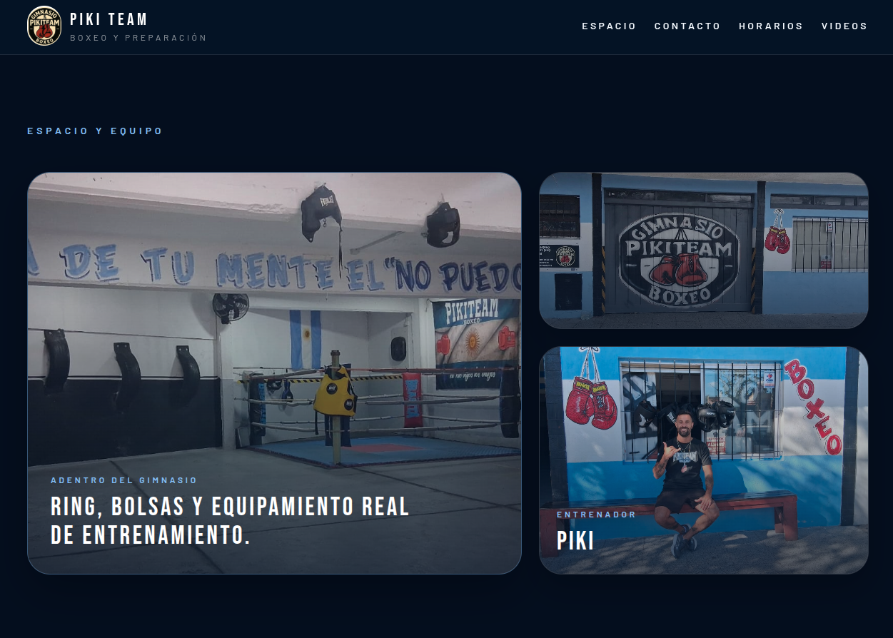
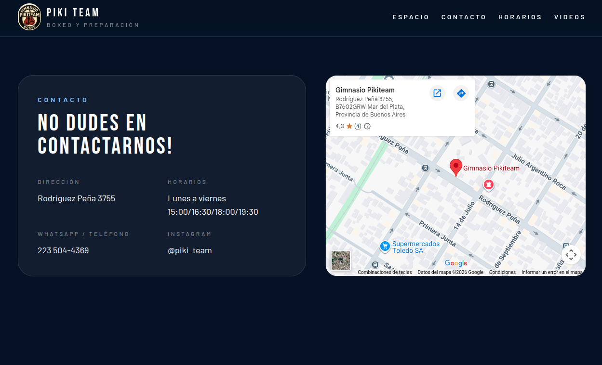
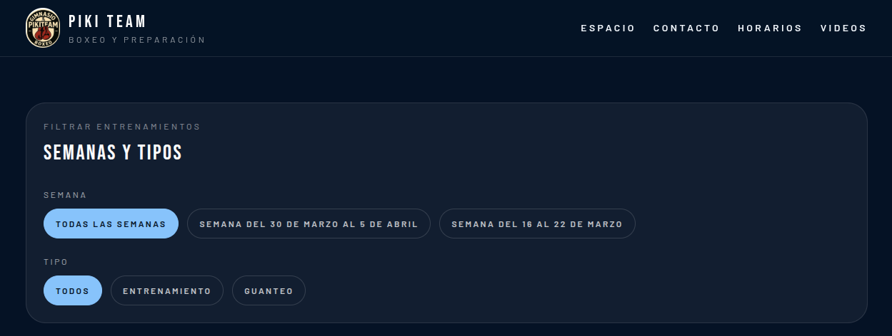
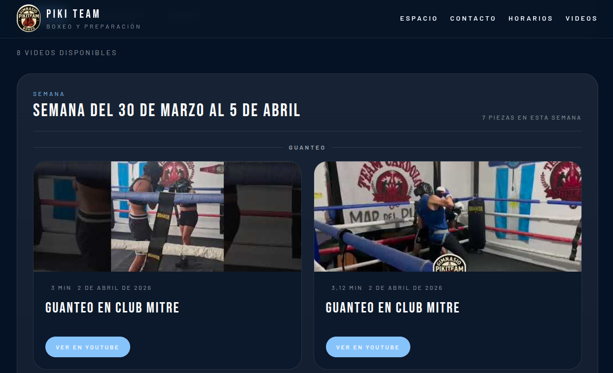

# Piki Team

A modern web platform for a boxing gym to organize training videos and centralize gym information.

---

## Problem

Training and sparring videos were being shared through WhatsApp, which made them easy to lose, hard to organize, and difficult to revisit over time.

---

## Solution

Piki Team provides a structured video library where content is automatically grouped by week and training type, allowing fighters and coaches to easily access past sessions and track progress.

---

##  Live Demo

https://pikiteam.vercel.app/

---

## Screenshots

### Home Page



### Contact Section



### Video Filters



### Video Library



---

## Features

*  Gym landing page with schedule and contact information
*  Video library organized automatically by calendar week
*  Filtering by training type (sparring / training)
*  Fast and responsive UI powered by Vite
*  Simple content management from a centralized file
*  Clean and modern design with Tailwind CSS

---

##  Tech Stack

* React 19
* TypeScript
* Vite
* Tailwind CSS 4

---

##  Project Structure

* `src/pages/` → main pages (`HomePage`, `VideosPage`)
* `src/components/` → reusable UI components
* `src/sections/` → home page sections
* `src/data/siteContent.ts` → centralized editable content
* `public/` → static assets and images

---

##  Installation

Clone the repository and run it locally:

```bash
git clone https://github.com/your-username/piki-team.git
cd piki-team
npm install
npm run dev
```

---

##  Video Organization Logic

Videos are automatically grouped by calendar week based on their `publishedAt` field.

* No manual configuration is required
* Adding a new video automatically updates the UI
* Weeks are calculated starting on Monday

---

##  Adding New Videos

To add a new video, update the `trainingVideos` array in:

```
src/data/siteContent.ts
```

Example:

```ts
{
  title: "Technical sparring",
  description: "Rounds focused on distance and defense.",
  youtubeId: "abc123",
  publishedAt: "2026-04-10",
  duration: "3 min",
  category: "Sparring",
  trainingType: "guanteo",
}
```

### Important rules

* `publishedAt` must follow `YYYY-MM-DD` format
* `trainingType` must be `"entrenamiento"` or `"guanteo"`
* `youtubeId` must be the video ID, not the full YouTube URL

---

##  Future Improvements

* User authentication
* Upload videos directly from the app
* Comments and likes system
* Improved mobile experience

---

##  What I Learned

* Structuring a scalable React + TypeScript project
* Designing UI driven by structured data
* Solving a real-world problem with a simple architecture
* Building a clean and maintainable component system

---

##  Notes

This project was built as a real solution for a boxing gym to improve how training content is stored and accessed.
